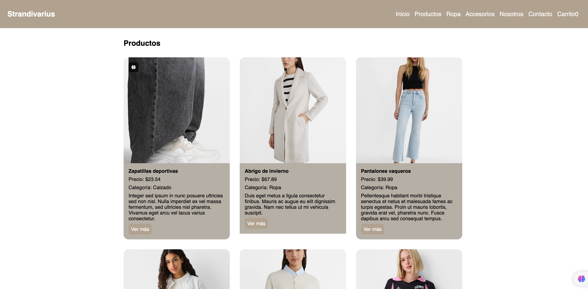

# Mi E-commerce de Ropa

## Descripción del Proyecto

¡Bienvenido al repositorio de **Mi E-commerce de Ropa**! Este proyecto es una aplicación de comercio electrónico desarrollada en React, diseñada para ofrecer una experiencia de compra intuitiva y moderna. La aplicación permite a los usuarios explorar productos por categoria y realizar una compra.





## Stack Usado

Este proyecto está construido utilizando una variedad de tecnologías modernas y bibliotecas para ofrecer una aplicación eficiente y bien estructurada. El stack tecnológico incluye:

- **React**: Biblioteca principal para construir la interfaz de usuario.
- **React Router DOM**: Para el manejo de rutas y navegación en la aplicación.
- **React Hook Form**: Para la gestión de formularios y validaciones.
- **Lucide React**: Para íconos y elementos gráficos.
- Bootstrap
## Uso / Instalación

Para empezar a trabajar con el proyecto, sigue estos pasos:

1. **Clona el Repositorio**

   ```bash
   git clone https://github.com/tu-usuario/mi-app.git
   ```

2. **Navega al Directorio del Proyecto**

   ```bash
   cd mi-app
   ```

3. **Instala las Dependencias**

   Asegúrate de tener [Node.js](https://nodejs.org/) y [npm](https://www.npmjs.com/) instalados. Luego, ejecuta el siguiente comando para instalar las dependencias del proyecto:

   ```bash
   npm install
   ```

4. **Inicia el Servidor de Desarrollo**

   Para ver la aplicación en acción, ejecuta:

   ```bash
   npm start
   ```

   Esto abrirá la aplicación en tu navegador predeterminado en `http://localhost:3000`.

5. **Construye el Proyecto para Producción**

   Para crear una versión optimizada para producción, ejecuta:

   ```bash
   npm run build
   ```

6. **Ejecuta las Pruebas**

   Para ejecutar las pruebas unitarias y de integración, usa:

   ```bash
   npm test
   ```

## Contribuciones

¡Las contribuciones son bienvenidas! Si tienes ideas para mejorar el proyecto o encuentras algún problema, no dudes en abrir un *issue* o enviar un *pull request*. 

## Licencia

Este proyecto está bajo la Licencia [MIT](https://opensource.org/licenses/MIT). Consulta el archivo `LICENSE` para obtener más detalles.

---

Si tienes alguna pregunta o necesitas asistencia, no dudes en contactarme.

¡Gracias por tu interés en **Mi E-commerce de Ropa**! 🚀👗👚
